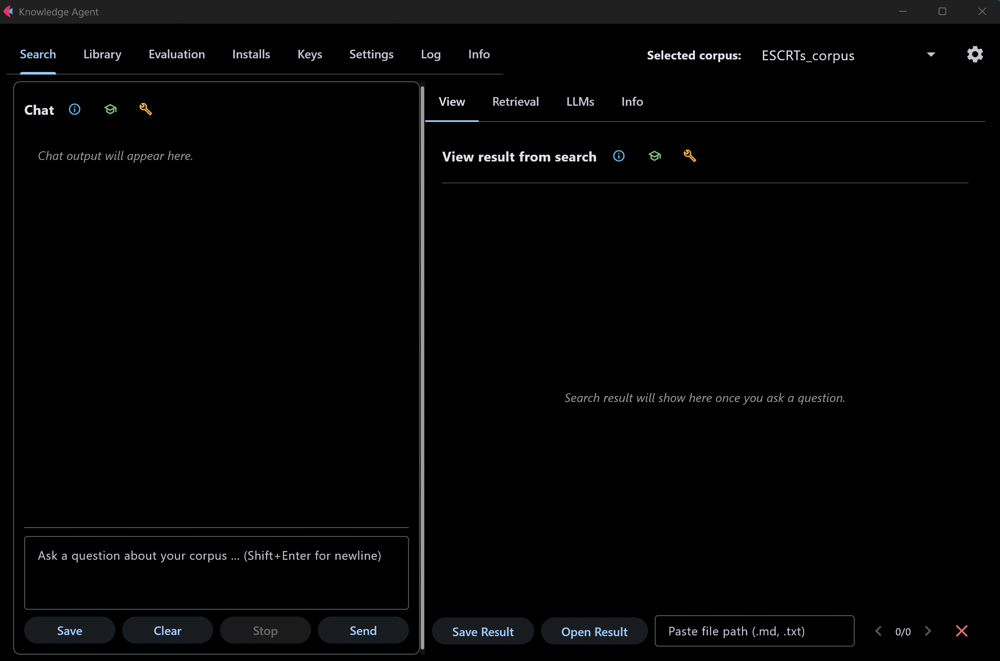
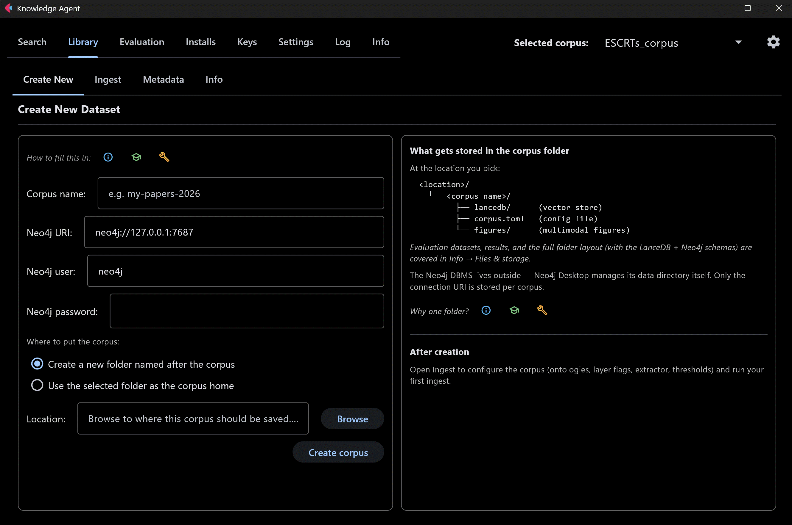
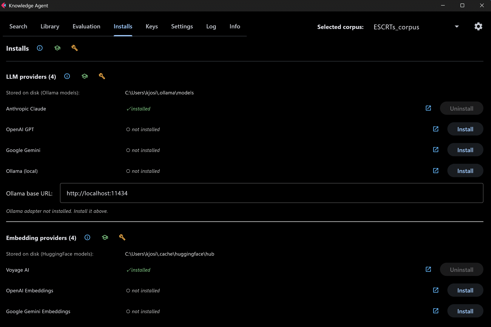
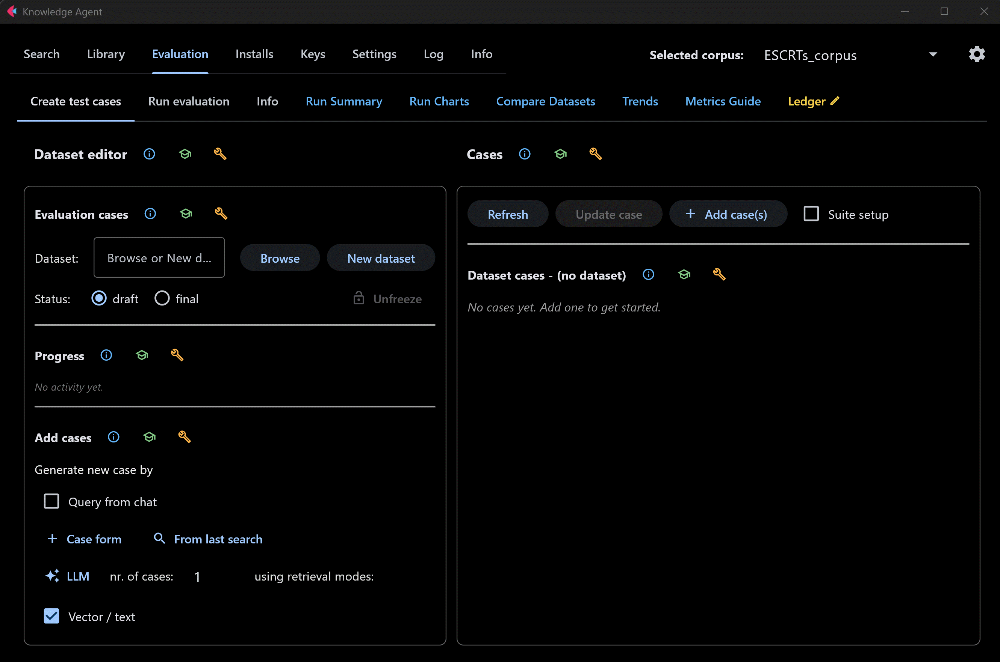

# Knowledge Agent

A desktop app for building a searchable **knowledge base** from your own documents
and asking questions of it in plain language. It combines **hybrid retrieval**
(vector + keyword search) with a **knowledge graph**, and answers with citations
back to the sources.

Knowledge Agent is **domain-agnostic** — it ships a broad tag taxonomy and adapts
to whatever documents you point it at, rather than being tied to one field.

> **Status — late-stage development (v0.1.0), not production software.**
> It runs end-to-end and is actively used, but it is **not** production-hardened:
> it hasn't had an external/independent security audit or load testing, the
> GUI is functional but not fully polished, some areas are still in flux,
> and pieces may be missing or rough. Treat it as a research / development
> preview rather than a finished, production-ready product.

## How it works

Two complementary stores work together:

- **LanceDB** — your documents are chunked and embedded for vector + BM25 hybrid
  search, so a question finds passages that are *semantically* similar even when
  the wording differs.
- **Neo4j** — a layered knowledge graph (documents, chunks, entities, ontology
  canonicals, typed relations, and cross-document links, plus optional OpenAlex
  bibliographic layers) answers questions that depend on *connections* across
  documents.

A **LangGraph** agent picks a retrieval strategy per question, retrieves from one
or both stores, and a language model synthesises a cited answer. The UI is a
**Flet** desktop app; there is also a headless CLI.

## Features

- **Build corpora** from many formats — PDF, DOCX, PPTX, XLSX, Markdown, HTML,
  LaTeX, CSV, JSON, images, audio/video, and source code.
- **Ask questions** and get cited, synthesised answers.
- **Tune retrieval** per query — result count, hybrid vs. vector-only, re-ranking,
  or a direct read-only Cypher query against the graph.
- **Layered knowledge graph** — chunks, entity extraction (LLM or GLiNER /
  HunFlair2), ontology linking across 18 ontologies, typed relations, and
  cross-document links — each layer independently toggleable per corpus.
- **Bring your own models** — Anthropic, OpenAI, Google, Voyage, Ollama (local),
  and Hugging Face — installed on demand; no provider is bundled. To run **fully
  offline with no API keys**, install [Ollama](https://ollama.com) (a separate
  binary) for the local LLM and use the local Hugging Face embedder; cloud
  providers stay optional.
- **Measure quality** — a built-in evaluation harness with registry-driven
  metrics, an optional LLM-as-judge panel, and JSON / CSV / SQLite reports.

## A look at the app

Short screen recordings of the desktop GUI.

**Search → View** — ask a question, get a cited answer.

**Library → Create New** — start a new corpus.

**Installs** — add LLM providers, embedders, extractors, parsers, and ontologies.

**Evaluation → Create test cases** — author evaluation cases.

## Install

Requires **Python 3.13+** and a running **Neo4j** database. Neo4j is a separate
install (it is not pip-installable): download **Neo4j Desktop** from
[neo4j.com/download](https://neo4j.com/download/), create a local database, set a
password, and start it. You point each corpus at its Neo4j connection when you
create the corpus in the app. **LanceDB** (the vector store) is embedded, with no
install and no server.

    pip install -e ".[dev]"

Model providers and heavy extractors are **opt-in extras** — install only what a
corpus needs, e.g.:

    pip install -e ".[llm-anthropic,embed-voyage]"     # a provider pair
    pip install -e ".[entities-gliner,parsers-asr]"    # NER + audio/video

## Run

- **GUI (`ka-gui`)** — the intended way to use the app, with the full feature
  set: create corpora, install providers, manage keys, ingest, browse and edit
  metadata, run bulk operations, chat with per-query retrieval tuning, and the
  evaluation dashboards.
- **CLI (`ka`)** — aimed at **developers and automation** (quick dev checks,
  cron, CI, scripting), **not** everyday interactive use. It runs against a
  corpus you already created in the GUI:
    - `ka ingest <folder>` — ingest documents into an existing corpus
    - `ka query "..."` — one-shot question, prints a cited answer
    - `ka health` — liveness probe (Neo4j, LanceDB, provider keys)
    - `ka eval ...` — run the evaluation harness over a dataset

  The CLI does **not** cover creating a corpus, installs, key management,
  metadata editing, bulk operations other than folder ingest (delete, re-embed,
  KG backfill), the conversational chat, or the evaluation dashboards — use the
  GUI for those.

Configuration (database URIs, API keys, retrieval defaults) lives in `.env` or is
set through the GUI; per-corpus settings live in each corpus's `corpus.toml`.

## Documentation

- **[ARCHITECTURE.md](ARCHITECTURE.md)** — how the system is organised, the
  ingest/query data flows, and the design decisions.
- **[CLAUDE.md](CLAUDE.md)** — orientation for AI coding assistants working in the
  repository.
- In-app **Info** tabs cover the storage layout, the LanceDB + Neo4j schemas, and
  how to use each screen.

## Testing

    pytest                     # unit — fast, no real services
    pytest -m integration      # real Neo4j test instance + LanceDB (opt-in)
    pytest -m e2e              # launches the Flet app (opt-in)

## License & citation

Released under the **PolyForm Noncommercial License 1.0.0** — see [LICENSE](LICENSE).
Free for **noncommercial use** (research, personal study, education, and other
nonprofit/public-interest purposes), including the freedom to modify and share
under the same terms. **Commercial use requires a separate license** from the
copyright holder.

If you use Knowledge Agent in your work, a citation is appreciated:

> Kjos, I. (2026). *Knowledge Agent* (Version 0.1.0) [Computer software].
> ORCID: [0000-0002-9166-3074](https://orcid.org/0000-0002-9166-3074)
